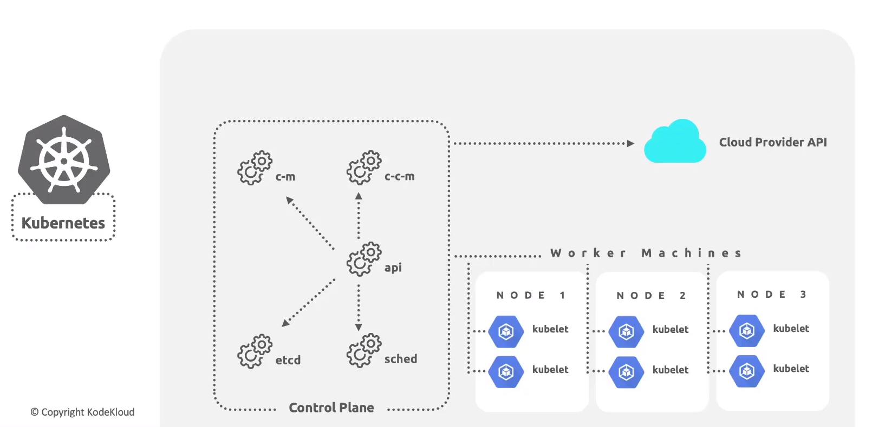

# High Level Overview

GKE benefits:
1. Managed Kubernetes Clusters.
2. Autoscaling. 
3. Load Balancing. 
4. Logging and Monitoring. 
5. Integration. 

GKE Concept:

Kubernetes cluster consist of a Control Plan and one or more nodes that are also known as worker machine to run containerized application. 

The control plan and nodes makes up the kuberneter cluster orchestration system. 

Structure:

Control Plan:
1. c-c-m - (Cloud Controller Manager) - It links the cluster into a cloud provider API and separates out the components that interact with the cloud platform from the component that only interacts with the cluster. 
2. c-c-m
3. etcd
4. sched
5. api 

Worked Nodes:
1. kubelet
2. kubelet 

