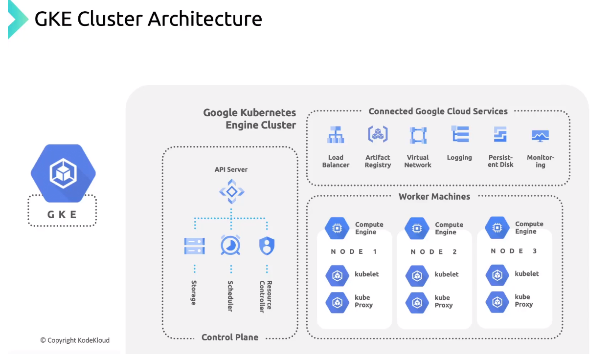

# High Level Overview

GKE benefits:
1. Managed Kubernetes Clusters.
2. Autoscaling. 
3. Load Balancing. 
4. Logging and Monitoring. 
5. Integration. 

GKE Concept:

Kubernetes cluster consist of a Control Plan and one or more nodes that are also known as worker machine to run containerized application. 

The control plan and nodes makes up the kuberneter cluster orchestration system. 

Structure:

Control Plane:
1. c-c-m - (Cloud Controller Manager) - It links the cluster into a Cloud Provider API and separates out the components that interact with the cloud platform from the component that only interacts with the cluster. 
2. c-m - (Kube Controller Manager) - It's a control plan component that runs controller processes such as node controller, job controller, endpoint slice controller and service account controller. 
3. api - (Kube API Server) - Is a component that exposes Kubernetes API and is the frontend of the Kubernetes Control Plane. 
4. etcd - It's a consistent and highly available key-value storage for storing all the cluster related data.
5. sched - (Kube Scheduler) - It watches for the newly created pods with no assigned node and selects a node for them to run on.

Worked Nodes:
1. kubelet - The Kubelet is responsible for managing the deployment of pods to Kubernetes nodes. It receives commands from the API server and instructs the container runtime to start or stop containers as needed.
2. kubeproxy - kube-proxy is a network proxy that runs on each node in your cluster, implementing part of the Kubernetes Service concept. kube-proxy maintains network rules on nodes. These network rules allow network communication to your Pods from network sessions inside or outside of your cluster.
3. daemonset - Provides functionality such as log collection and intra-cluster network connectivity.

GKE manages the complete lifecycle of the control plane and all its system from cluster creation to deletion etc. 

Here is the GKE Structure:

Node Pool: Is like a subset of nodes within the cluster that share a common configuation such as memory or CPU generation. It also provides an easy way to ensure that the workloads run on the righ hardware within a GKE cluster. 

GKE Services:

GKE Modes:
1. Autopilot - Nodes are managed by the GKE cluster.
2. Standard - Nodes are managed by the end user.

