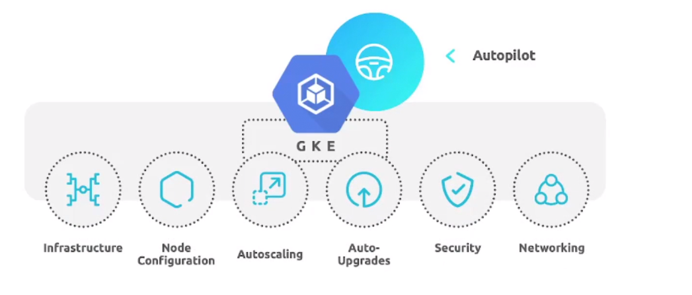
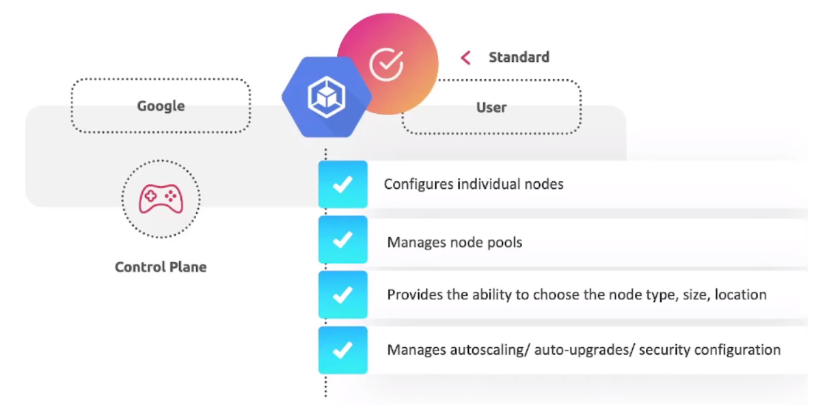
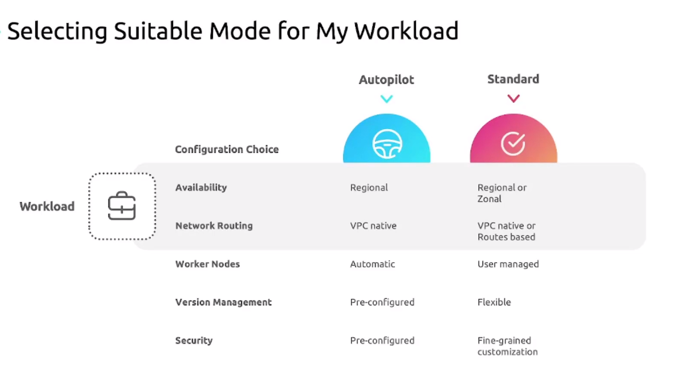
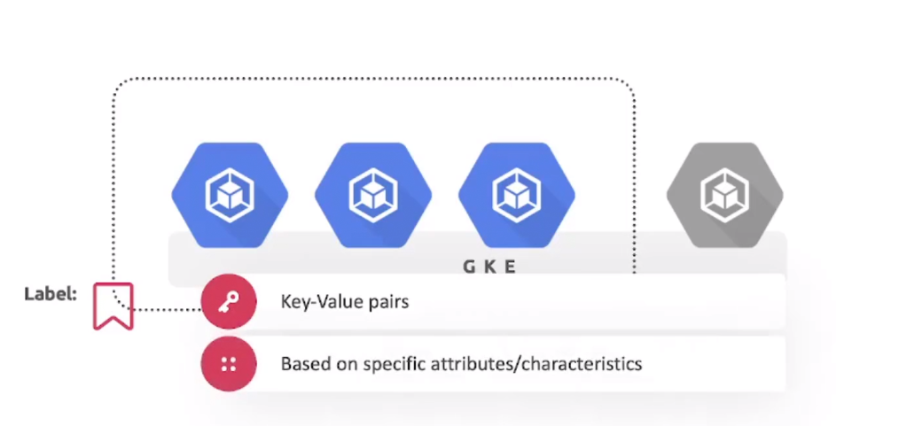
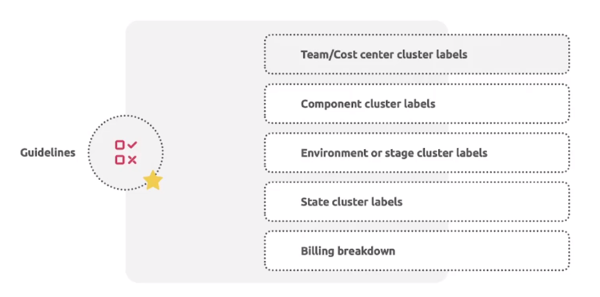
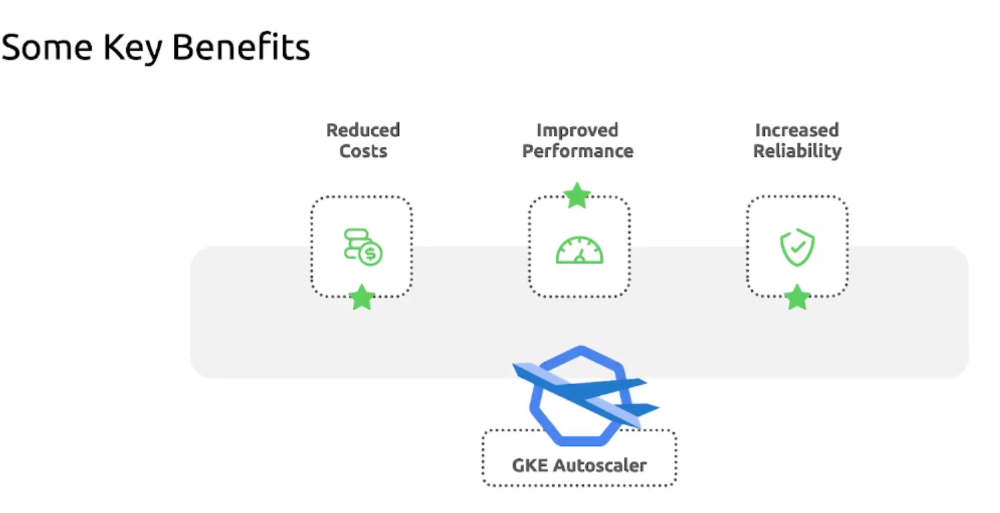

# Deployment and Administration


## Section Introduction

Labs:
1. Create our first cluster. 
2. Install kubectl and configure cluster access.
3. Apply labels and tags to GKE clusters. 
4. Configure cluster autoscaling. 
5. Configure and manage monitoring and logging. 


## GKE Modes of Operation. 

Two types:

1. Autopilot
2. Standard


Autopilot: 


Google manages the underlying infrastructure which includes node configuration, auto scaling, auto update, base line security configuration, and networking. The users simple deploy application to GKE, and google takes care of the rest. 


Standard:


Google manages the control plane in a GKE Standard mode while users are responsible for managing the nodes. 

Standard cluster can be created in two way of zone setup:

1. Zonal
2. Regional


Zonal Cluster: A zonal cluster is deployed on a single zone. It means it has only one control plane running in a zone. If that particular zone has an outage, cluster resources will also become unavailable. 

A zonal cluster can be distributed as single zone or multiple zone. 
In a signle zonal cluster, there will only be a singple control plane within the same zone for managing the nodes. 

On the other hand, on a multi-zonal cluster there is still a single replica of control plan running in a zone, managing worked nodes running in multiple zone. 

A multi-zonal cluster is resilient to zonal failures. 


Regional Cluster: 


Regional vs Zonal Cluster:



Create GKE using Goocle Cloud Shell/Terminal:

Set cluster zone
```$ gcloud config set compute/zone asia-east1-a```

Create cluster with custom resource
```$ gcloud container clusters create gke-cluster-name --num-nodes=1 --disk-type=pd-standard --disk-size=10```

Check the cluster if created or not- See list
```$ gcloud container clusters list```

Current cluster config
```$ gcloud config list```


## Kubectl
A command line tool used to interact with any kubernetes cluster. It is a primary interfqace for managing and deploying applications to Kubernetes. 

To install and setup kubectl, we need to follow certain steps:

```$ gcloud components install kubectl / sudo apt install kubectl```
```$ kubectl version```
```$ gcloud components install gke-gcloud-auth-plugin / sudo apt-get install google-cloud-sdk-gke-gcloud-auth-plugin```
```$ gke-gcloud-auth-plugin --version```
```$ gcloud container clusters get-credentials CLUSTER_NAME --region=COMPUTE_REGION```
```$ kubectl config view```


## GKE Labels

GKE Labels are key-value pairs that are assigned to a GKE cluster to organize and catagorize them based on specific attributes or characteristics. 

Label adding guidelines:


Applying Labels:

```$ gcloud container clusters describe cluster_name```
```$ gcloud container clusters update CLUSTER_NAME --update-labels=LABEL_NAME=LABEL_VALUE [Update cluster with a new label]```
```$ gcloud container clusters update CLUSTER_NAME --remove-labels=LABEL_NAME [Remove labels from cluster]```


## GKE Autoscaler
It monitors the workload on the cluster and automatically adds or removes nodes as needed to keep the workload running smoothly. It dynamically scales up or down, ensuring that we have the right amount of resources available to run containerized application. It helps ensuring the availability as well as maitaining the cost optimization. 


A minimum or maximum size of the node pool is specifies in the cluster configuration and rest everything else is automatic. 

#### With Autopilot clusters, we don't need to manually provision nodes or manage node pools because node pools are automatically provisioned and managed through node auto-provisioning. 
#### We only need to configure it in standard mode. 

Key benefits or GKE Autoscaler:



## Configure cluster autoscaler

```$ gcloud container clusters create gke-cluster-name --enable=autoscaling --num-nodes=1 --min-nodes=1 --max-nodes=5 --disk-type=pd-standard --disk-size=10```


## Upgrading the cluster version

```$ gcloud container get-server-config [See all available master and node versions]```

```$ gcloud container clusters upgrade CLUSTER_NAME --master --cluster-version VERSION_TO_UPGRADED_TO [Upgrade the master node]```

```$ gcloud container clusters upgrade CLUSTER_NAME --node-pool=default-pool --cluster-version=VERSION_TO_BE_UPGRADED_TO [Upgrade the nodepool compatible with master node version]```


## Monitoring and Logging.

Its like a dedicated supervisor who monitors everything in the cluster that involves the collection, analysis, and visualization of data related to the GKE cluster performance, health and resource utilizations.  Monitors always allows us to gain insight into the overall system behaviours and identifying the anomalies and the potential problems. 

When a GKE cluster is created, cloud monitoring and logging are automatically enabled by default and provide observability. 


