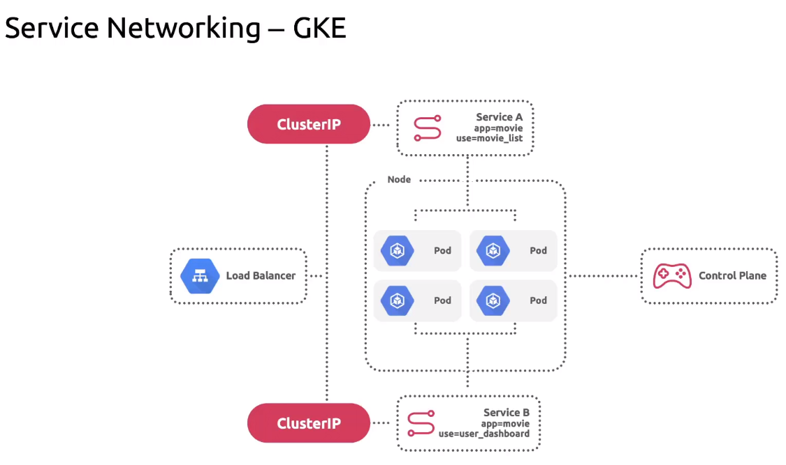
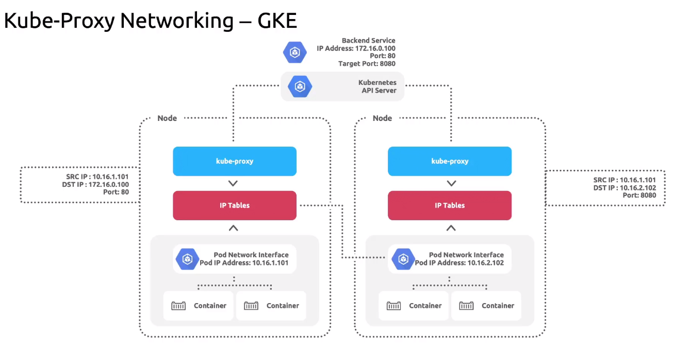

# Networking for GKE Cluster

GKE Cluster allows connectivity for 
1. Public and 
2. Private network. 

The control plane of a GKE cluster is associated with either a Public IP or a Private IP address. 

Multiple pods can run on a single node, and each node belongs to a node pool. 

GKE enables seamless communication and networking between pods within a cluster by establishing network namespaces and pod IP ranges. It also utilizes linux bridges. The infrastructure ensures that containers within a pod can communicate effectively and pods can exchange data and interact with each other as required by the application architecture. 

Service Networking:


Each service in Kubernetes is assigned a stable and reliable IP address known as the Cluster IP. This IP address is choosen from the cluster's pool of available service IP address and remains constant throughout the lifecycle of the service. Additionally, kubernetes assigns a host name to the cluster IP by creating a DNS entry. The cluster IP and the host name are unique within the cluster, allowing other components and applications to reliably access the service. 
The purpose of service is to provide load balancing accross the set of pods that mache the labels specified in the label selector. 


In GKE, connectivity around the pods and services as managed by kube-proxy component. By default, kube-proxy is deployed as a daemonset, ensuring that pods running kube-proxy is available on each node in the cluster. 

Kube-proxy continuously monitors the kubernetes API server to maintain a mapping between the server's cluster IP and the healthy pods associated with it. 

The service is associate with a port and a targer port. 
The port is the entry point where clients reach the application, while the target port is the port where application is actually listening for traffic within the pod. Kube-proxy manages this port re-mapping by manipulating the IP table tools on the node. 




Private Cluster:
By default this cluster doesn't allow any direct internet access for nodes and pods. This isolation ensures that the cluster's resources are not directly exposed to the publc internet. In this cluster, nodes are assigned with private IP addresses. 


## Creating a private cluster. 

```$ gcloud config set compute/zone us-west1-a```

```$ gcloud container clusters create CLUSTER_NAME --num-nodes=1 --disk-type=pd-standard --disk-size=10 --create-subnetwork name=SUBNET_NAME --enable-ip-alias --enable-private-nodes --enable-private-endpoint --master-ipv4-cird 172.16.0.32/28```


